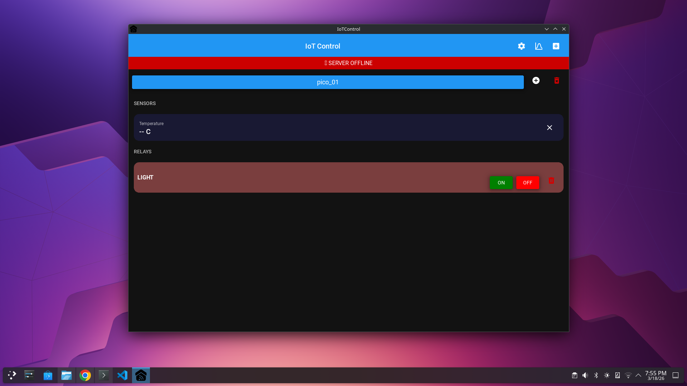
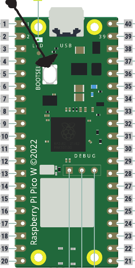

# iotcontrol

An all-in-one, 100% Python IoT ecosystem designed for simplicity.

**iotcontrol** removes the barriers to entry for IoT development. Built specifically for beginners and makers, it eliminates the complexity of low-level coding by providing a unified Python SDK that works across both your microcontrollers (via CircuitPython) and an  Android /windows/linux application (via Kivy/paho-mqtt).

By handling the "heavy lifting" of communication, the SDK allows you to focus on building your project rather than troubleshooting MQTT protocols or managing socket connections.




---

## 🛠️ How to Set Up(example project )
---

### Step 1 — Flash the Pico W with CircuitPython

1. Go to the [CircuitPython download page for Raspberry Pi Pico W](https://circuitpython.org/board/raspberry_pi_pico_w/) and download the latest stable `.uf2` file.

2. Hold down the **BOOTSEL** button on your Pico W, then — while still holding it — connect the Pico to your PC via a micro-USB data cable.

   

3. The Pico will appear as a USB drive named **`RPI-RP2`**.

4. Drag and drop the downloaded `.uf2` file into the `RPI-RP2` drive.

5. The Pico will automatically eject and reconnect as a drive named **`CIRCUITPY`**. You're ready for the next step.

---

### Step 2 — Set Up the SDK and Example Code

1. Download and extract this repository, then open the folder named **`circuitpython code.py +sdk`**.

2. Copy the **entire contents** of that folder to the Pico (the `CIRCUITPY` drive).

3. Install [Thonny IDE](https://thonny.org/).

4. Open Thonny, go to **Run → Configure Interpreter**, and change the interpreter from *Local Python 3* to **CircuitPython (generic)**. Click **OK**.

5. Click the **Stop/Restart** button — the Pico should now be detected.

6. Click **View → Files** to browse the files on the Pico.

7. Open `code.py` (this is the example code for using the SDK). Scroll down to find:
   ```python
   device_id = "pico_01"
   ```
   Change `pico_01` to any unique ID you want to use for this device.

8. Open `settings.toml` and fill in your Wi-Fi credentials:
   ```toml
   WIFI_SSID = "Your_WiFi_SSID"
   WIFI_PASSWORD = "Your_Password"
   ```

> **⚠️ Hardware Note:** The example code requires a **DHT11 sensor** connected to **pin 3**, and a **4-channel active low  relay module** connected as follows:
>
> | Pin | Relay   |
> |-----|---------|
> | 16  | Relay 1 |
> | 17  | Relay 2 |
> | 18  | Relay 3 |
> | 19  | Relay 4 |

---

### Step 3 — Set Up the MQTT Broker(optinal)
##you can use a public mqtt brokern like [HiveMQ](https://www.hivemq.com/mqtt/public-mqtt-broker/) if you are using V1.1.1+ of the APP
On any PC or Raspberry Pi running Linux, open a terminal and run:

```bash
sudo apt update && sudo apt upgrade -y
sudo apt install mosquitto mosquitto-clients -y

# Check that the service is running (you should see "active (running)")
sudo systemctl status mosquitto

#edidt mosquito config
sudo nano /etc/mosquitto/mosquitto.conf
#Scroll to the end of the file and paste these two lines:
listener 1883 0.0.0.0
allow_anonymous true
#then press ctrl+s (save)then ctrl+x (exit)
# Allow firewall access (if you have ufw enabled)
sudo ufw allow 1883
```

> **⚠️ Note:** The broker machine must be on the **same local network** as your Pico W.

To find the broker's IP address, run:
```bash
hostname -I
```

Then go back to `code.py` on the Pico and set the broker variable to that IP address.

---

### Step 4 — Set Up the App

1. Download the latest release of the **IotControl app** (Windows, Linux, Android) from the [Releases page](https://github.com/mohamedCraft13/iotcontrol/releases) and install it.

2. Open the app, tap the **Settings (⚙️)** icon, and configure:
   - **Broker IP** → your broker's IP address or ,you can use a public mqtt brokern like [HiveMQ](https://www.hivemq.com/mqtt/public-mqtt-broker/) if you are using V1.1.1+ of the APP
   - **Port** → `1883`
   - **Device MQTT ID** → any unique name for your phone/app instance *(make sure no other device uses the same name)*

   Tap **Save**.

3. Tap the **`+`** button. You'll be prompted to enter a **Device ID** — this must match the `device_id` you set in `code.py` on the Pico. Tap **ADD**.

4. Tap the **`⊞`** button (top-right) to add a control tile. You'll need to set:
   - **Label** → any display name you want
   - **Command** → the command the Pico will receive

   > 📝 **Note:** These commands are specific to the example code. If you wrote your own firmware, use the commands defined in your code. For the **4-relay example**, add tiles with commands `relay1`, `relay2`, `relay3`, and `relay4`.

   Tap **Save**.

formore info on the usage of the app watch this [video](https://youtube.com/shorts/8ljhEil_UkE?feature=share)
---

You're all set! 🎉 Your Pico W should now be connected to the broker and controllable from the app.

---

## 📄 License

This project is licensed under the [GPL-3.0 License](LICENSE).
